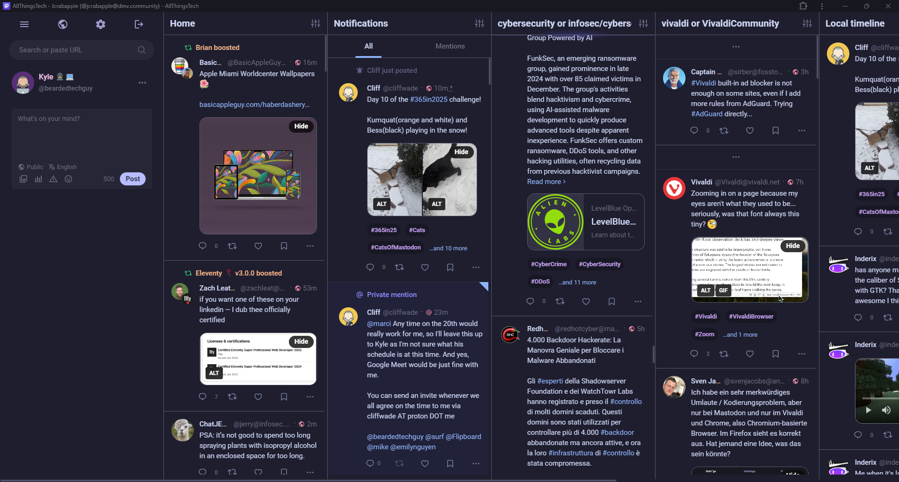

## Catpuccin Mocha UI for Mastodon (A multi-column experience)

  

Theme colors taken from [Jason Crabtree's](https://github.com/jcrabapple/mastodon-bird-ui-catppuccin-mocha) Catpuccin Mocha BirdUI. It has been edited so the compose area is on the left as opposed to the right as in the original [BirdUI](https://github.com/ronilaukkarinen/mastodon-bird-ui).

## How to install

Right now, you will need to install via an extension like [Stylus](https://chromewebstore.google.com/detail/stylus/clngdbkpkpeebahjckkjfobafhncgmne) to apply the CSS to your browser.

1. Create a new Style.
2. Copy the contents of layout-multiple-columns.css
3. Paste contents into the new stylus style, enter the URL(s) you want it to apply to, and save your style.
4. Now when you go to the URL(s) you entered, the style will be applied.  
