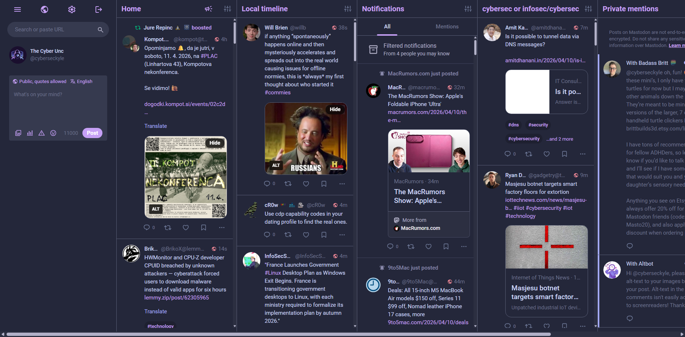

## Catppuccin Complete UI for Mastodon

Catppuccin Complete UI for Mastodon is my Catppuccin-flavored Mastodon theme project, inspired by Bird UI and built around the way I actually like Mastodon to feel day to day.

It started as a personal Mocha-style advanced-web setup, then grew into a more complete package with:

- Catppuccin `Mocha`, `Macchiato`, `Frappe`, and `Latte`
- full Catppuccin accent color selection
- a configurable Stylus/UserCSS install
- fixed CSS downloads for people who do not want runtime options
- support for both regular Mastodon and the advanced web interface
- my preferred advanced-web layout tweaks, including the larger left-side composer

## Table of Contents

- [Catppuccin Complete UI for Mastodon](#catppuccin-complete-ui-for-mastodon)
- [Table of Contents](#table-of-contents)
- [Why This Theme Exists](#why-this-theme-exists)
- [Highlights](#highlights)
- [Files and Downloads](#files-and-downloads)
- [Installation](#installation)
  - [Recommended: Stylus / UserCSS](#recommended-stylus--usercss)
  - [Plain CSS: Default Exports](#plain-css-default-exports)
  - [Plain CSS: Fixed Flavor + Accent Files](#plain-css-fixed-flavor--accent-files)
  - [Instance Admin Install](#instance-admin-install)
- [Theme Options](#theme-options)
- [Compatibility](#compatibility)
- [Support](#support)
- [Credits](#credits)

## Why This Theme Exists

Bird UI already proved that Mastodon could feel more intentional, comfortable, and desktop-friendly. What I wanted on top of that was something more specifically tuned to my own use:

- Catppuccin colors across light and dark flavors
- broader accent control
- stronger coverage in the advanced web interface
- a larger composer moved to the left side
- ready-to-use files for people who want either UserCSS options or plain CSS

This project is the result of that.

## Highlights

- One configurable UserCSS file for people using Stylus or similar extensions
- Separate fixed CSS files for advanced web and regular view
- Organized fixed exports for every Catppuccin flavor and accent combination
- Improved accent coverage across more of the interface
- Theme-aware color handling for both dark and light Catppuccin flavors
- Advanced web is the most customized layout, but regular Mastodon is included too

## Files and Downloads

| File or folder | Best for | Notes |
| --- | --- | --- |
| `catppuccin-complete-ui.user.css` | Stylus and other userstyle managers | Recommended install. Covers both layouts and includes theme options. |
| `layout-multiple-columns.css` | Advanced web / multi-column view | Default fixed Mocha export. |
| `layout-single-column.css` | Regular Mastodon view | Default fixed Mocha export. |
| `themes/multi-column/<flavor>/<accent>.css` | Advanced web users who want a fixed variant | Plain CSS, no runtime options. |
| `themes/single-column/<flavor>/<accent>.css` | Regular-view users who want a fixed variant | Plain CSS, no runtime options. |

The `themes/` folder currently contains `120` fixed exports:

- `4` flavors
- `15` accent choices
- `2` layout targets

## Installation

### Recommended: Stylus / UserCSS

1. Install [Stylus](https://add0n.com/stylus.html) or another userstyle-compatible extension.
2. Open `catppuccin-complete-ui.user.css` from this repo.
3. Set the style to your Mastodon instance URL if your extension asks for site matching.
4. Save it, then use the Stylus settings panel to choose your flavor, accent, layout options, and widths.

### Plain CSS: Default Exports

Use this if you just want the default Mocha setup without UserCSS options.

1. Create a new style in Stylus or your preferred custom CSS tool.
2. Paste `layout-multiple-columns.css` for advanced web view.
3. Paste `layout-single-column.css` for the regular single-column interface if you want both layouts covered.
4. Save the style for your Mastodon instance.

### Plain CSS: Fixed Flavor + Accent Files

Use this if you want a specific Catppuccin flavor and accent, but do not want a configurable UserCSS install.

1. Open the `themes/` folder in this repo.
2. Choose `multi-column` or `single-column`.
3. Choose your flavor folder: `mocha`, `macchiato`, `frappe`, or `latte`.
4. Pick the accent file you want, such as `default.css`, `blue.css`, `rosewater.css`, or `teal.css`.
5. Paste that file into a new style for your Mastodon instance.

### Instance Admin Install

If you are applying this at the server level for your instance instead of as a personal userstyle:

1. Open your Mastodon admin appearance settings.
2. Paste the CSS you want into the instance Custom CSS area.
3. Use the fixed CSS exports rather than the configurable UserCSS file.

## Theme Options

The configurable userstyle currently supports:

- Catppuccin flavor: `Mocha`, `Macchiato`, `Frappe`, `Latte`
- Accent color: the full Catppuccin accent range
- Composer side: `left` or `right`
- Surface treatment: `soft`, `flat`, `glass`
- Composer width
- Timeline column width
- Optional active-header glow

## Compatibility

- This project is currently documented against Mastodon `4.5.0`.
- The advanced web interface is the most customized layout in this project.
- Regular Mastodon view is included and styled with the same Catppuccin token system.
- Upstream Bird UI `3.0.0` also mentions support for `4.6.0-alpha.0`, but this project is still pinned to an older Bird UI commit and may still need small selector updates on newer Mastodon builds.
- Heavily customized Mastodon forks or instance-specific patches may still need minor local tweaks.

## Support

If you like the project and want to support future updates:

## Credits

- [Bird UI](https://github.com/ronilaukkarinen/mastodon-bird-ui) by Rolle for the original visual inspiration and CSS groundwork
- [Catppuccin](https://catppuccin.com/) for the palette system
