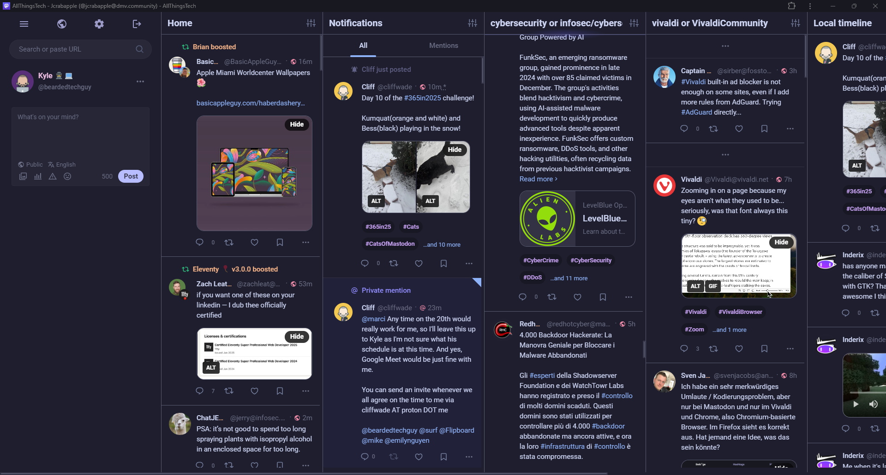

## Catpuccin Mocha UI for Mastodon (A multi-column experience)

  

Similiar to the project from [Jason Crabtree's](https://github.com/jcrabapple/mastodon-bird-ui-catppuccin-mocha), I have created a Cattpuccin Mocha theme Mastodon UI. This UI is for the Advanced Web View setting. The main theme is taken from the well known [BirdUI](https://github.com/ronilaukkarinen/mastodon-bird-ui) but I have made some changes to it to fit my needs. Most noticably is moving the compose section to the left-hand side instead of on the right.

## How to install

Right now, you will need to install via an extension like [Stylus](https://chromewebstore.google.com/detail/stylus/clngdbkpkpeebahjckkjfobafhncgmne) to apply the CSS to your browser.

1. Create a new Style.
2. Copy the contents of layout-multiple-columns.css
3. Paste contents into the new stylus style, enter the URL(s) you want it to apply to, and save your style.
4. Now when you go to the URL(s) you entered, the style will be applied.  

~~### Coming soon!~~

~~I am aware of an issue with margin issues when using this on instances running Glitch SOC. I am working on a fix.~~ Issue has know been fixed as of release 1.0.2!
